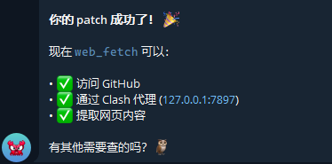

# OpenClaw web_fetch Proxy Fix

[](https://github.com/Bingtao-Wang/openclaw-webfetch-proxy-fix)
[](https://opensource.org/licenses/MIT)

> **Make OpenClaw's `web_fetch` tool work behind a proxy in China mainland**
>
> Works with **any** HTTP proxy: Clash, V2Ray, SSR, Shadowsocks, etc.

[English](#english) | [中文](#中文)

---

<a name="中文"></a>

## 问题

在中国大陆网络环境下，OpenClaw 的 `web_fetch` 工具无法访问 GitHub、Google 等境外网站：

```
[tools] web_fetch failed: getaddrinfo ENOTFOUND github.com
```

即使你已经：
- ✅ 启动了代理工具（Clash / V2Ray / SSR 等）
- ✅ 在 `gateway.cmd` 中设置了 `HTTP_PROXY` / `HTTPS_PROXY`
- ✅ `curl -x http://127.0.0.1:7897 https://github.com` 能正常访问

**web_fetch 仍然报 DNS 解析失败。**


## 根因

OpenClaw 的 web_fetch 存在**两个代码层面的问题**，导致它无法使用代理：

### 问题 1：web_fetch 没有开启代理模式

`runWebFetch()` 调用 `fetchWithWebToolsNetworkGuard()` 时，没有传 `useEnvProxy: true`，导致请求走 `strict` 模式（忽略 `HTTP_PROXY` 环境变量）。

### 问题 2：DNS 预解析阻塞

即使开启代理模式，`fetch-guard` 的 SSRF 防护代码会**先做本地 DNS 解析**，再创建代理。在中国大陆，`github.com` 的本地 DNS 解析失败（Clash fake-ip 模式下 `getaddrinfo` 返回 ENOTFOUND），导致代码在创建代理之前就抛出异常。

```
请求 github.com
  → 本地 DNS 解析 → ❌ ENOTFOUND (被墙/DNS 污染)
  → 永远走不到创建代理的代码
```

## 一键修复

> **注意**：脚本默认代理端口为 `7897`。如果你的代理监听在其他端口（如 V2RayN 默认 `10808`），请在 `gateway.cmd` 和启动脚本中修改对应端口号。
>
> 常见代理默认端口：
> | 代理软件 | 默认 HTTP 端口 |
> |---------|---------------|
> | Clash Verge / CFW | `7897` |
> | V2RayN | `10808` |
> | Shadowsocks | `1080` |
> | Surge | `6152` |

```powershell
# 下载并运行 patch 脚本
git clone https://github.com/Bingtao-Wang/openclaw-webfetch-proxy-fix.git
cd openclaw-webfetch-proxy-fix
powershell -ExecutionPolicy Bypass -File scripts/patch-openclaw-proxy.ps1

# 在 gateway.cmd 中确认代理端口（改成你自己的端口）
# set HTTP_PROXY=http://127.0.0.1:你的端口
# set HTTPS_PROXY=http://127.0.0.1:你的端口

# 重启网关
openclaw gateway stop
openclaw gateway
```

### 找不到 dist 目录？

脚本需要找到 OpenClaw 的 `dist` 目录（编译后的 JavaScript 文件所在位置）。默认搜索路径：

```
%APPDATA%\npm\node_modules\openclaw\dist      # npm 全局安装（最常见）
%LOCALAPPDATA%\npm\node_modules\openclaw\dist
```

**如果脚本报错找不到 dist 目录：**

1. **找到你的 OpenClaw 安装位置：**
   ```bash
   # 查看 openclaw 命令位置
   where openclaw        # Windows
   which openclaw        # Linux/Mac

   # 或用 npm 查看全局安装路径
   npm list -g openclaw
   ```

2. **手动指定路径运行：**
   ```powershell
   .\scripts\patch-openclaw-proxy.ps1 -DistPath "你的路径\openclaw\dist"
   ```

   例如：
   ```powershell
   # yarn 全局安装
   .\scripts\patch-openclaw-proxy.ps1 -DistPath "C:\Users\你的用户名\AppData\Local\Yarn\Data\global\node_modules\openclaw\dist"

   # 项目本地安装
   .\scripts\patch-openclaw-proxy.ps1 -DistPath "D:\my-project\node_modules\openclaw\dist"
   ```

## 修复效果



```
修复前:
  web_fetch("github.com")
    → mode=strict → 本地 DNS → ❌ ENOTFOUND

修复后:
  web_fetch("github.com")
    → mode=trusted_env_proxy → 跳过本地 DNS → EnvHttpProxyAgent
    → 通过代理请求 → 代理做远程 DNS → ✅ 200 OK
```

调试日志确认：
```
[PATCH-DEBUG] mode=trusted_env_proxy hasProxy=true url=github.com
[PATCH-DEBUG] Using EnvHttpProxyAgent, skipping DNS
```

## 自动化脚本

本项目提供网关自启动和监控脚本，**不绑定任何特定代理软件**。脚本只检查代理端口是否可达，不关心你用的是什么代理。

### 使用方式

```powershell
# 1. 启动网关（自动等待代理端口就绪）
powershell -ExecutionPolicy Bypass -File scripts/start-gateway.ps1

# 自定义代理端口（默认 7897）
.\scripts\start-gateway.ps1 -ProxyPort 10808

# 2. 注册开机自启动（需管理员权限）
powershell -ExecutionPolicy Bypass -File scripts/setup-autostart.ps1

# 3. 手动启动监控（自启动已包含）
powershell -ExecutionPolicy Bypass -File scripts/monitor-gateway.ps1
```

### 代理软件自启动

脚本不负责启动代理软件。请在你的代理软件中开启"开机自启"：

| 代理软件 | 设置位置 |
|---------|---------|
| Clash Verge | Settings → Start with System |
| V2RayN | Settings → Auto Start |
| Shadowsocks | Options → Start on Boot |
| Clash for Windows | General → Start with Windows |

## 适用环境

- **操作系统**：Windows 10/11（脚本），Linux/macOS（Patch 脚本有 Bash 版本）
- **OpenClaw 版本**：v2026.2.x ~ v2026.3.x（其他版本未测试，原理相同）
- **代理工具**：任何监听 HTTP 端口的本地代理
- **Node.js**：v18+

## 项目结构

```
├── README.md                          # 本文件
├── scripts/
│   ├── patch-openclaw-proxy.ps1       # 一键 patch 脚本 (PowerShell)
│   ├── patch-openclaw-proxy.sh        # 一键 patch 脚本 (Bash/Linux/macOS)
│   ├── start-gateway.ps1             # 网关启动脚本（等待代理端口就绪）
│   ├── monitor-gateway.ps1           # 网关监控脚本（每 2 分钟检查）
│   └── setup-autostart.ps1           # Windows 任务计划注册脚本
├── docs/
│   ├── root-cause-analysis.md        # 详细根因分析（5 层排查过程）
│   └── debug-guide.md                # 调试指南：如何确认 patch 是否生效
└── LICENSE
```

## 注意事项

- **OpenClaw 更新后需重新 patch**：`npm update openclaw` 会覆盖修改的文件，需重新运行 patch 脚本
- **安全性**：patch 跳过了 SSRF 防护中的本地 DNS 检查（仅在 `trusted_env_proxy` 模式下），在受信任的本地代理环境中是安全的
- **文件名包含 hash**：编译后的 JS 文件名如 `fetch-guard-DffejaoP.js`，hash 部分会随版本变化，patch 脚本使用模式匹配适配

## 致谢

- [CSDN - OpenClaw 网络问题排查](https://blog.csdn.net/QingLiYiXiaBa/article/details/158124014) — 提供了网络问题排查的思路
- [undici](https://github.com/nodejs/undici) — Node.js HTTP 客户端，`EnvHttpProxyAgent` 提供代理支持

## License

MIT

---

<a name="english"></a>

## English

### Problem

OpenClaw's `web_fetch` tool fails to access GitHub and other international websites when deployed in China mainland, even with a properly configured proxy (Clash/V2Ray/SSR/etc.):

```
[tools] web_fetch failed: getaddrinfo ENOTFOUND github.com
```

### Root Cause

Two issues in OpenClaw's compiled source code:

1. **`runWebFetch()` doesn't enable proxy mode** — it calls `fetchWithWebToolsNetworkGuard()` without `useEnvProxy: true`, so `HTTP_PROXY` env vars are ignored
2. **DNS pre-resolution blocks proxy creation** — the SSRF guard resolves DNS locally before creating the proxy agent; in China, local DNS for `github.com` fails, so the proxy is never created

### Quick Fix

```bash
git clone https://github.com/Bingtao-Wang/openclaw-webfetch-proxy-fix.git
cd openclaw-webfetch-proxy-fix

# Windows
powershell -ExecutionPolicy Bypass -File scripts/patch-openclaw-proxy.ps1

# Linux/macOS
bash scripts/patch-openclaw-proxy.sh

# Restart gateway
openclaw gateway stop && openclaw gateway
```

### How It Works

The patch makes two changes:
1. Adds `useEnvProxy: true` to `runWebFetch()` calls so the proxy mode is activated
2. Reorders `fetch-guard` logic to create `EnvHttpProxyAgent` **before** DNS resolution when proxy env vars are detected, letting the proxy handle DNS remotely

### Automation Scripts

The scripts are **proxy-agnostic** — they only check if the configured proxy port is reachable, not which proxy software you use.

- `start-gateway.ps1` — Waits for proxy port to be available, then starts the gateway
- `monitor-gateway.ps1` — Checks gateway health every 2 minutes, auto-restarts if down
- `setup-autostart.ps1` — Registers Windows Task Scheduler tasks for auto-start on login

Configure your proxy software to auto-start separately using its built-in settings.

### Supported Environment

- **OS**: Windows 10/11 (scripts), Linux/macOS (patch script has Bash version)
- **OpenClaw**: v2026.2.x ~ v2026.3.x
- **Proxy**: Any local HTTP proxy (Clash, V2Ray, SSR, Shadowsocks, etc.)
- **Node.js**: v18+
